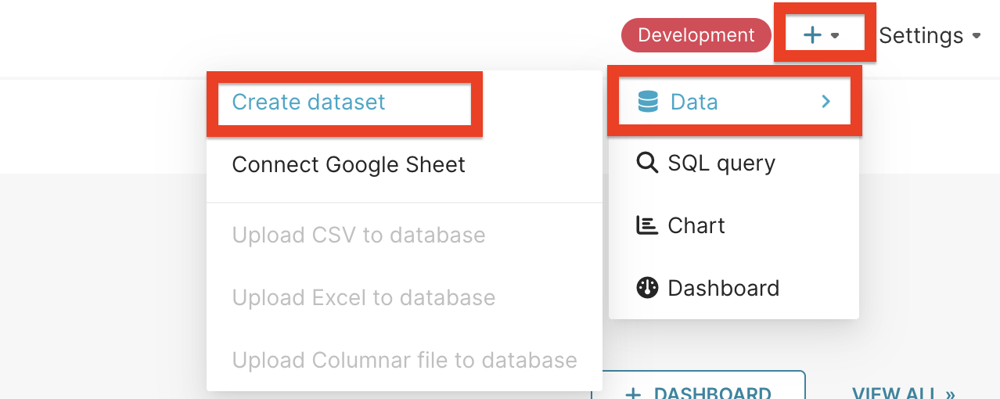
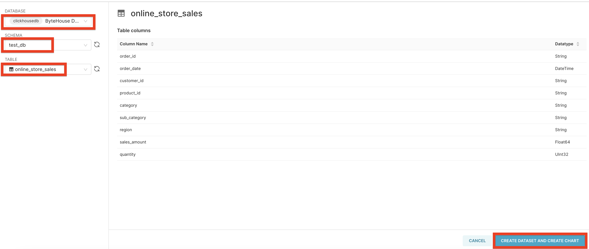
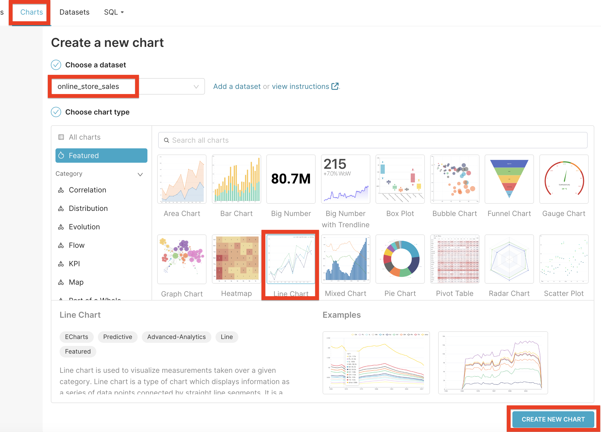
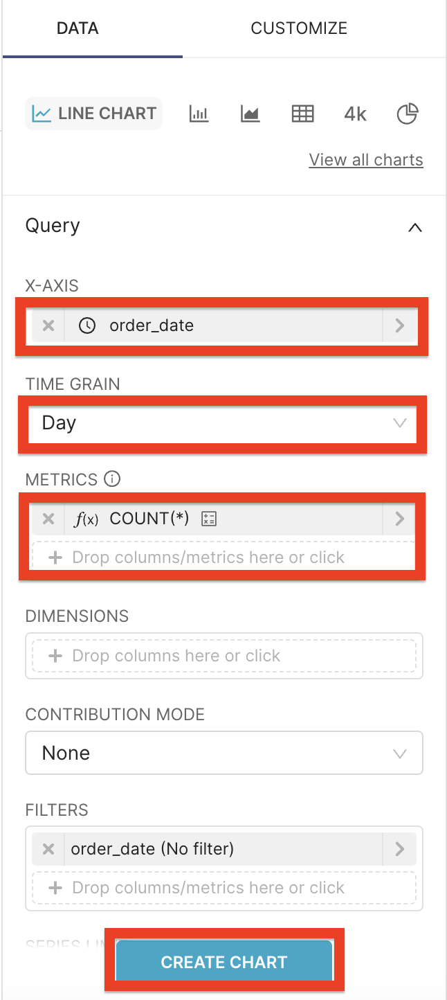
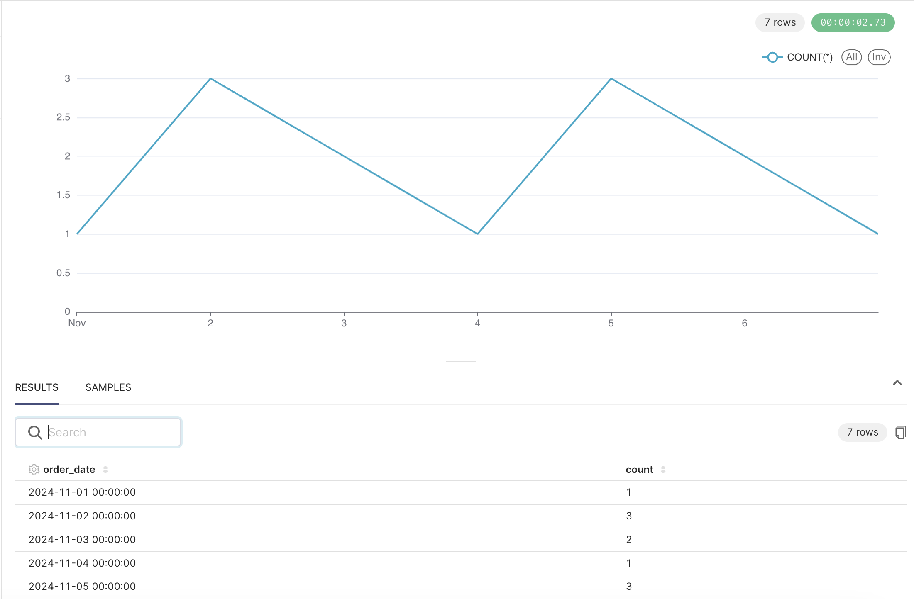

# Superset via ClickHouse Connect (HTTP)

## Overview
| **Description**                          | **Details**                                                                                      |
|------------------------------------------|--------------------------------------------------------------------------------------------------|
| **Superset Official Documentation Page** | [Superset Docs](https://superset.apache.org/docs/intro/)                                         |
| **ClickHouse Documentation Page**        | [ClickHouse Docs](https://clickhouse.com/docs/en/integrations/superset)                          |
| **Base Superset Version**                | [4.1.0](https://github.com/apache/superset/releases/tag/4.1.0)                                   |
| **Base ClickHouse Connect Version**      | [0.8.6](https://pypi.org/project/clickhouse-connect/0.8.6/)                                      |
| **ByteHouse Connect Version**            | [0.8.6+bytehouse](https://github.com/bytehouse-docs/ecosystem/tree/main/dist/clickhouse-connect) |
| **Verified Python Version**              | Python 3.8                                                                                       |

## Installation
`ByteHouse` cannot natively support `Superset` via `ClickHouse Connect`. We require some additional modifications to the
`ClickHouse Connect` package. Modified version is available here
[ByteHouse modified connector](https://github.com/bytehouse-docs/ecosystem/tree/main/dist/clickhouse-connect). 

You can install it via `pip`:
```bash
https://github.com/bytehouse-docs/ecosystem/raw/main/dist/clickhouse-connect/clickhouse-connect-0.8.6+bytehouse.tar.gz
```

The complete installation instructions can be found in the `Superset` official documentation Page. Installation via 
`Docker` is given below for quick reference:
```bash
git clone https://github.com/apache/superset.git
cd superset
git checkout 4.1.0
echo "https://github.com/bytehouse-docs/ecosystem/raw/main/dist/clickhouse-connect/clickhouse-connect-0.8.6+bytehouse.tar.gz" >> ./requirements/local.txt
docker compose -f docker-compose-image-tag.yml up
```

## Log into Superset
Once the installation is complete, you can log into `Superset` by visiting `http://localhost:8088` in your browser with
the default created account:
```bash
username: admin
password: admin
```

## Connect Superset to ByteHouse
1. Click on the `Settings` tab in the top right corner of the screen & choose `Database Connections`.

2. Click on the `+ DATABASE` button to create a new database connection.

3. Choose `ClickHouse Connect (SuperSet)` from the available databases' dropdown menu.

4. Fill in the connection details as shown below & click on the `CONNECT` button.

| **Description**       | **Details**                                 |
|-----------------------|---------------------------------------------|
| HOST                  | gateway-v2.bytehouse-cn-{REGION}.volces.com |
| PORT                  | 19000                                       |
| DATABASE NAME         | Database name                               |
| USERNAME              | bytehouse                                   |
| PASSWORD              | ByteHouse API Key                           |
| DISPLAY NAME          | Display name as you want                    |
| ADDITIONAL PARAMETERS | secure=True&compress=False                  |
| SSL                   | Needs to be turned on                       |


## Prepare Sample Data
Execute following queries in `ByteHouse` to prepare sample data. You can execute these queries via 
`ByteHouse Console` or `Superset SQL Lab`.
```sql
CREATE DATABASE test_db;

CREATE TABLE test_db.online_store_sales (
    order_id String,
    order_date DateTime,
    customer_id String,
    product_id String,
    category String,
    sub_category String,
    region String,
    sales_amount Float64,
    quantity UInt32
) 
ENGINE = CnchMergeTree()
PARTITION BY toYYYYMM(order_date)
ORDER BY (order_date, customer_id);

INSERT INTO test_db.online_store_sales VALUES
('OID001', '2024-11-01 10:00:00', 'CID001', 'PID001', 'Electronics', 'Smartphones', 'North America', 899.99, 2),
('OID004', '2024-11-02 09:20:00', 'CID004', 'PID004', 'Furniture', 'Desks', 'North America', 1599.99, 5),
('OID005', '2024-11-02 14:10:00', 'CID005', 'PID005', 'Home Decor', 'Lamps', 'South America', 49.99, 100),
('OID006', '2024-11-02 17:50:00', 'CID006', 'PID006', 'Electronics', 'Tablets', 'Europe', 799.99, 7),
('OID007', '2024-11-03 11:00:00', 'CID007', 'PID007', 'Clothing', 'Jackets', 'Asia', 149.99, 25),
('OID008', '2024-11-03 13:40:00', 'CID008', 'PID008', 'Clothing', 'Shoes', 'Africa', 89.99, 50),
('OID010', '2024-11-04 19:30:00', 'CID010', 'PID010', 'Electronics', 'Cameras', 'North America', 399.99, 3),
('OID013', '2024-11-05 08:50:00', 'CID013', 'PID013', 'Electronics', 'Headphones', 'North America', 99.99, 100),
('OID014', '2024-11-05 11:30:00', 'CID014', 'PID014', 'Furniture', 'Coffee Tables', 'Asia', 499.99, 50),
('OID015', '2024-11-05 14:00:00', 'CID015', 'PID015', 'Clothing', 'T-Shirts', 'Europe', 19.99, 300),
('OID016', '2024-11-06 09:40:00', 'CID016', 'PID016', 'Furniture', 'Bookshelves', 'North America', 999.99, 10),
('OID017', '2024-11-06 13:25:00', 'CID017', 'PID017', 'Electronics', 'Laptops', 'Europe', 2299.99, 4),
('OID020', '2024-11-07 14:00:00', 'CID020', 'PID020', 'Home Decor', 'Rugs', 'Africa', 199.99, 20);
```

## Create Superset Dataset
1. Click on the `+` button in the top right corner of the screen & choose `Data` & choose `Create dataset`.

2. Choose `DATABASE`, `SCHEMA` & `TABLE` from the dropdown menu & click on the `CREATE DATASET AND CREATE CHART` button.


## Create Superset Chart
1. From `Charts` tab, choose the previously created dataset & choose `Line Chart` as chart type. Proceed to click on 
the `CREATE NEW CHART` button.

2. Choose `order_date` column as `X-AXIS`, `Day` as `TIME GRAIN` & `COUNT(*)` as `METRIC`. Proceed to click on the 
`CREATE CHART` button.

3. The chart will be displayed as shown below.



