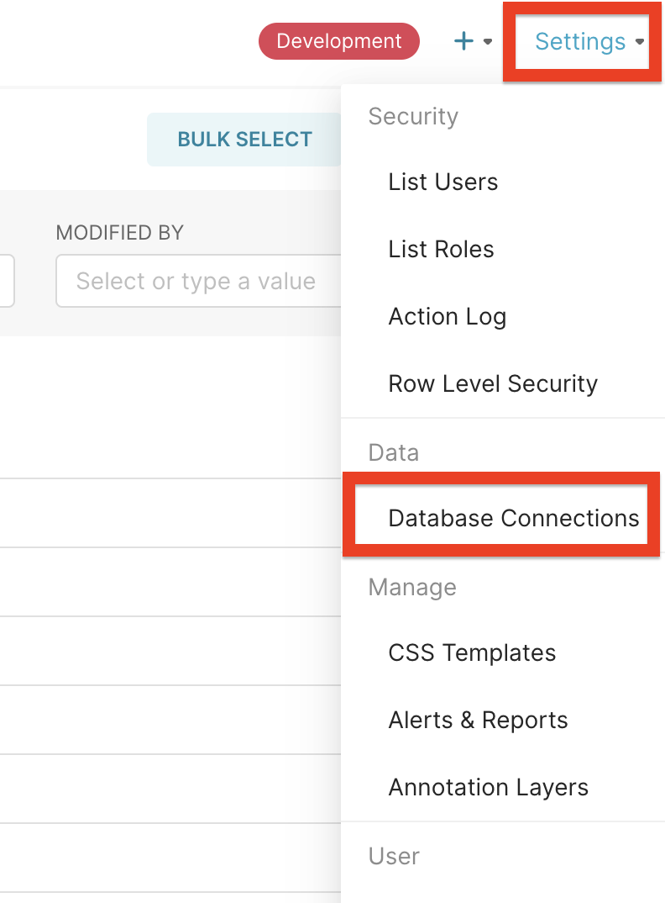
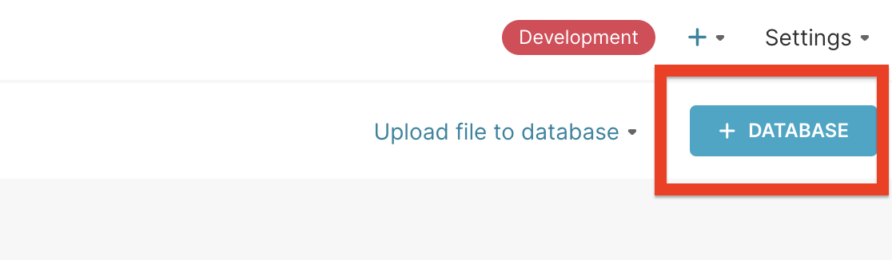
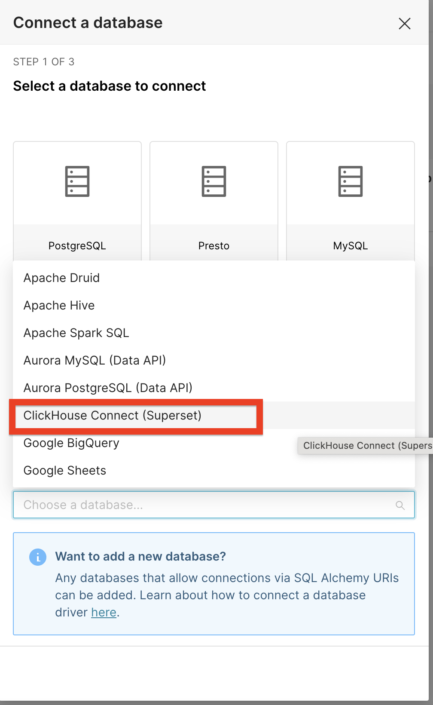
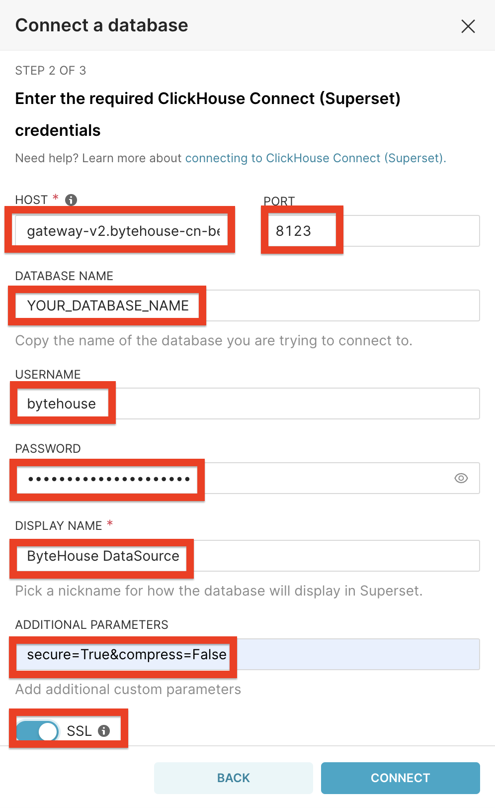

# Superset via ClickHouse Connect (HTTP)

## Overview
| **Description**                          | **Details**                                                             |
|------------------------------------------|-------------------------------------------------------------------------|
| **Superset Official Documentation Page** | [Superset Docs](https://superset.apache.org/docs/intro/)                |
| **ClickHouse Documentation Page**        | [ClickHouse Docs](https://clickhouse.com/docs/en/integrations/superset) |
| **Base Superset Version**                | [4.1.0](https://github.com/apache/superset/releases/tag/4.1.0)          |
| **Base ClickHouse Connect Version**      | [0.8.6](https://pypi.org/project/clickhouse-connect/0.8.6/)             |
| **Verified Python Version**              | Python 3.8                                                              |

## Installation
`ByteHouse` cannot natively support `Superset` via `ClickHouse Connect`. We require some additional modifications to the
`ClickHouse Connect` package. Modified version is available here
[ByteHouse modified connector](https://github.com/bytehouse-docs/ecosystem/tree/main/dist/clickhouse-connect). 

You can install it via `pip`:
```bash
https://github.com/bytehouse-docs/ecosystem/raw/main/dist/clickhouse-connect/clickhouse-connect-0.8.6+bytehouse.tar.gz
```

The complete installation instructions can be found in the `Superset` official documentation Page. Installation via 
`Docker` is given below for quick reference:
```bash
git clone https://github.com/apache/superset.git
cd superset
git checkout 4.1.0
echo "https://github.com/bytehouse-docs/ecosystem/raw/main/dist/clickhouse-connect/clickhouse-connect-0.8.6+bytehouse.tar.gz" >> ./requirements/local.txt
docker compose -f docker-compose-image-tag.yml up
```

## Log into Superset
Once the installation is complete, you can log into `Superset` by visiting `http://localhost:8088` in your browser with
the default created account:
```bash
username: admin
password: admin
```

## Connect Superset to ByteHouse
1. Click on the `Settings` tab in the top right corner of the screen & choose `Database Connections`.
<br>

2. Click on the `+ DATABASE` button to create a new database connection.
<br>

3. Choose `ClickHouse Connect (SuperSet)` from the available databases' dropdown menu.
<br>

4. Fill in the connection details as shown below & click on the `CONNECT` button.
<br>


| **Description**       | **Details**                                 |
|-----------------------|---------------------------------------------|
| HOST                  | gateway-v2.bytehouse-cn-{REGION}.volces.com |
| PORT                  | 19000                                       |
| DATABASE NAME         | Database name                               |
| USERNAME              | bytehouse                                   |
| PASSWORD              | ByteHouse API Key                           |
| DISPLAY NAME          | Display name as you want                    |
| ADDITIONAL PARAMETERS | secure=True&compress=False                  |
| SSL                   | Needs to be turned on                       |


